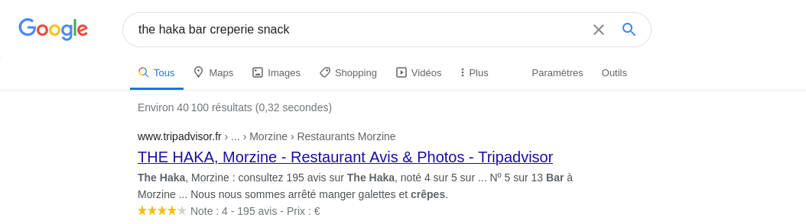

+++
page_template = "article.html"
title = "retour_sur_le_ractf_2020"
date = 2020-06-15
[taxonomies]
tags = ["ctf", "writeups"]
+++

# Introduction
Du 5 au 7 juin dernier, j'ai pu participé au [Ractf](https://2020.ractf.co.uk), un CTF en ligne sur un week end, avec l'équipe du SDD, fraîchement créée pour l'occasion. L'objectif n'était clairement pas de finir sur le podium, mais nous avons quand même réussi à finir dans les 50 premières équipes de ce CTF.
<!-- more -->
# Mon retour sur le ctf
Je me suis principalement concentré sur les challenges de type OSINT ou Open Source INTelligence, (Renseignement d'origine source ouverte en bon français), une discipline souvent mis en arrière plan mais qui constitue en général la première phase de reconnaissance d'une cible dans le cadre d'une attaque. Le but est de rassembler le plus d'information possible sur une cible afin de pouvoir mener en suite des campagnes de phising et d'ingénieurie sociale les plus efficaces possibles: on cherchera des adresses mails, des numéros de téléphones, des noms, des passions, des adresses, des lieux de toutes les personnes liées à une cible.

Cette introduction faite, passons au coeur du sujet: les différents challenge du **Ractf** 2020.
## Les challenges
### Remote Retreat
Le premier challenge auquel je me suis attaqué était le challenge **Remote Retreat**. On nous pose un contexte, ou une compagnie essaie de retrouver une des ses cibles et elle a reussi à recupérer une photo instagram. Mais on nous précise qu'il n'y a pas de données [EXIF](https://en.wikipedia.org/wiki/Exif) associée à image. Elle nous demande de trouver d'où la photo a été prise. Hum.... des données EXIF? En recherchant un peu, on apprend que le format exif est un format de metadonnées associées aux média qui permet d'ajouter des informations sur le contexte du media, comme des dates, des localisations et des informations sur le périphérique qui a été utilisé. Arf, cela signifie qu'on va être obligé de se fier uniquement à l'image et un peu de réflexion pour trouver l'endroit où été prise la photo, que voici: 
{{ resize_image(path="articles/ractf_2020/ractf_2020_remote_retreat.jpeg", width=450, height=450, op="scale") }}

Ici on voit plusieurs détails très interessant: le paysage est montagneux, qui donne déjà des indications sur l'endroit: ce genre de paysage me font penser à la suisse ou la savoie ou la haute savoie. De plus, on voit un panneau de restaurant, et on peut lire: **the haka bar, crêperie snack**. Avec une recherche google rapide, on obtient: 

Il semblerait donc que c'est un restaurant en Haute Savoie, ce qui confirme ma première intuition. En suivant le lien google, on apprend que le restaurant est noté 4 étoiles sur 5, un score tout à fait honorable mais on apprend surtout l'adresse du lieu: **57 Route de la Combe À Zore, 74110 Morzine**. Bingo! On a une adresse, vérifions sur google maps et street view, si le lieu ressemble bien à celui où se trouve notre cible. 

{{ resize_image(path="articles/ractf_2020/morzine_streetview.png", width=450, height=450, op="fit") }}

C'est bien le même lieu! Et voila **250 points** remportés :). Passons au prochain challenge.

### Suspended Belief
Ce 2ème challenge est dans la continuité du premier car il faut encore retrouver un lieu à partir d'une image instagram et encore une fois, pas d'aide des métadonnées. L'image en question: 
{{ resize_image(path="articles/ractf_2020/suspended_belief.jpg", width=600, height=600, op="fit") }}

Cette image m'inspire déjà beaucoup moins, elle va être plus retord. On remarque 2 ponts à haubans. En cherchant "pont à haubans" sur google, le 2 ème résultat nous enmène sur une page wikipédia de la liste des ponts à haubans remarquables, cela va sûrement être un bon début. On cherche 2 ponts très proches à haubans, sur la mer et pas loin d'une ville industrielle. On a directement une photo de chaque pont, et en cherchant un peu, on remarque le pont de Ting Kau, qui ressemble beaucoup à l'un des ponts sur la photo:  {{ resize_image(path="articles/ractf_2020/ting_kau_brigde.JPG", width=600, height=600, op="fit") }}

Sur la photo sur la page wiki, on a les mêmes pointes jaunes sur la photo, et de plus, on voit un 2ème pont proche ainsi que des collines très ressemblantes. Avec la même technique que précedemment, on recherche avec gmaps et street view un point de vue qui se rapproche le plus possible de la photo du challenge. Et voilà, **350 points supplémentaires** :).

### Dead Man
Passons au 3 ème challenge, cette fois-ci, notre homme se trouve dans un cimetière.

{{ resize_image(path="articles/ractf_2020/dead_man.jpg", width=600, height=600, op="fit")}}

La premiere chose à voir, ce sont les chapeaux des jardiniers au premier plan, qui peuvent évoquer un pays asiatique. Cette première idée est confirmée par l'arrière plan où l'on voit 2 devantures ou l'on voit une écriture qui semble être du thaï, notre lieu pourrait donc etre en thaïlande? De plus, cela ressemble fortement à un cimetière militaire, les tombes sont sommaires et tout alignées. On recherche avec google maps "thaïlande cimetière militaire". Le premier résultat donne le cimetière de kanchanaburi. Avec notre ami streetview, on peut arriver à cette image: 

{{ resize_image(path="articles/ractf_2020/kanchanaburi_war_cemetery.png", width=600, height=600, op="fit")}}

Il semblerait bien qu'on soit au bon endroit :). **Et 350 points supplémentaires**.

### Brick by Brick
Pour ce challenge, on nous fournit encore une image dans un mail: voici l'image:
{{ resize_image(path="articles/ractf_2020/brick_by_brick.jpg", width=600, height=600, op="fit")}}

On remarque directement 2 drapeaux, nous y reviendront juste après. On peut déjà dire qu'on se retrouve dans une ville médiévale. Les drapeaux, en recherchant un peu, se trouvent être des drapeaux de la catalogne. Nous sommes donc dans un village médieval catalan. Demandons à notre ami google ce qu'il en pense. Le site [lesfrancaisdebarcelones](http://www.lesfrancaisdebarcelone.com) nous donne la liste des plus beaux villages de catalogne et on tombe sur le numero 4, besalu.
{{ resize_image(path="articles/ractf_2020/besalu.jpg", width=600, height=600, op="fit")}}

Avouez que ça ressemble beaucoup à notre photo. Pour en avoir le coeur net, je fais la recherche sur gmaps en me mettant en vue satellite, et après quelques minutes de balade, j'obtiens ce cliché:

{{ resize_image(path="articles/ractf_2020/besalu_bridge.png", width=600, height=600, op="fit") }}

C'est donc surement sur ce chemin de terre que la photo à été prise. Bien joué! et voila **400 nouveaux points**.

Passons au dernier challenge

### Tree man
Ce dernier challenge fut le plus long à résoudre pour moi.

{{ resize_image(path="articles/ractf_2020/tree_man.png", width=600, height=600, op="fit")}}

Au début, j'ai cherché avec des mots clefs sur la statut, sans vraiment de succès. En réalité, il a 2 détails à remarquer sur cette photo: dans l'arrière plan, on voit un drapeau espagnol et on remarque aussi des montagnes russes: nous sommes donc dans un parc d'attraction espagnol. Pour ce challenge, on va procéder par élimination car, les mots clefs que j'ai utilisé n'ont rien donnés. En cherchant, le plus gros parc d'attraction d'espagne est le park "PortAventura". Avec google maps en vue satellite, on cherche un environnement avec un lac, et des montagnes russes. On a de la chance, au centre du parc se trouve un lac qui répond bien à nos critères. On cherche aux bords du lac, un sol en bois (visible sur la photo). Et en y allant avec streetview...

{{ resize_image(path="articles/ractf_2020/tree_man_solution.png", width=600, height=600, op="fit") }}

Bingo! Ce challenge était plus dur que les autres. Mais voilà, on peut rajouter encore **300 points**.

# Conclusion
Ce ctf était le premier auquel j'ai participé avec l'équipe du SDD, c'était une super expérience et les ctf en général permettent d'apprendre pleins de choses. Je laisse le lien vers le [Ractf](https://ractf.co.uk/). J'y serais probablement l'an prochain pour essayer de m'atteler à d'autres catégories que l'OSINT.